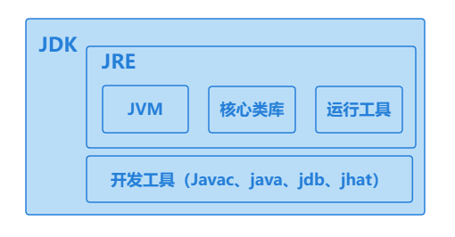
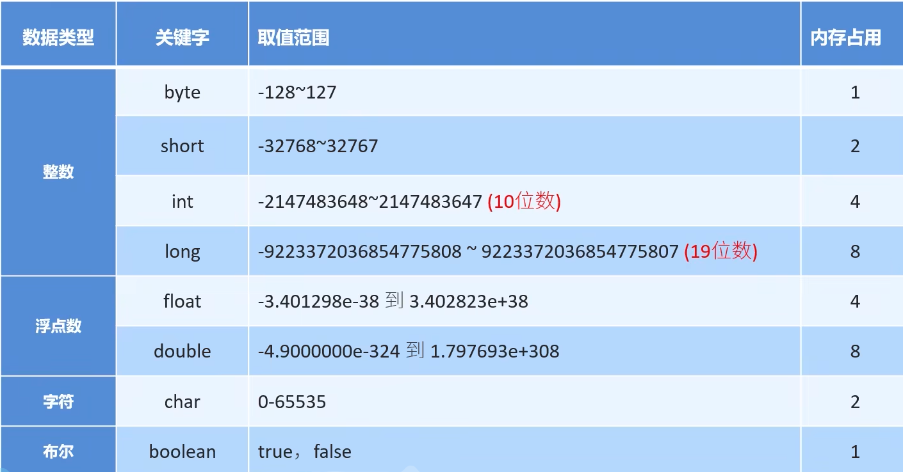
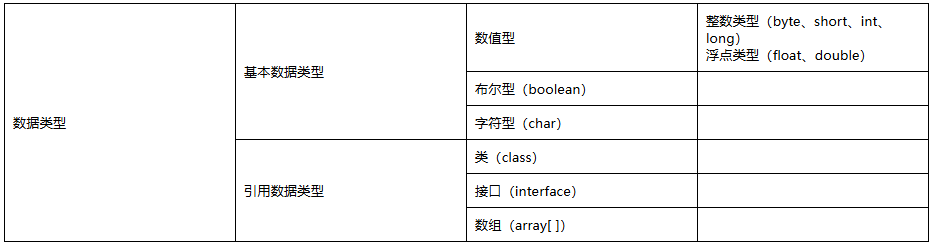

- # java基础

## 1、jdk、jre、jvm三者之间的关系

jdk(Java Development Kit)： Java 开发工具包， Java从源码编译，到运行所需要的工具集。

- JVM虚拟机： Java程序运行的地方
- 核心类库： Java已经写好的东西，我们可以直接用
- 开发工具： javac、 java 、jdb、jhat(内存分析工具)

jre：Java 的运行环境，是Java在虚拟机运行时i所用到的工具集 

- JVM、核心类库、运行工具



## 2、什么是关键字

关键字就是被Java赋予了特定含义的英文单词

- 关键字的字母都是小写的
- 常用的代码编辑器，会对关键字进行特殊颜色标记、

class关键字就表示定义一个类，后面跟一个类名

## 3、数据类型



> [!CAUTION]
>
> 声明long型变量时，必须在数据后面以小写的“l”或大写的"L"结尾
>
> 声明float浮点类型的变量，也需要加一个“F”结尾，double不需要
>
> 整数和小数取值范围的大小关系： double > float > long > int > short > byte

①变量类型分类

按数据类型分：——四类八种




## 4、标识符

- [ ] 由26个英文字母大小写、0-9、_或$组成
- [ ] 数字不可以开头
- [ ] 不可以使用关键字和保留字，但能包含保留字和关键字
- [ ] Java中严格的区分大小写，长度无限制
- [ ] 标识符不能包含空格 

**Java名称命名规范：**

- 包名：多个单词组成时所有字母都小写——xxxyyyzzz
- 类名、接口名：多个单词组成时，所有单词首字母大写——XxxYyyZzz
- 变量名、方法名：多个单词组成时，每一个单词首字母小写，第二个单词开始首字母大写——xxxYyyZzz
- 常量名：所有字母都大写，多个单词时每个单词用下划线连接口。XXX_YYY_ZZZ

## 5、键盘录入

```
1、导包 ：import java.util.Scanner;

2、Scanner 实例化  Scanner scan = new Scanner(Sysem.in);、
  int i= scan.nextInt();
```

6、随机数生成

如何获取一个随机数：double value = Math.random();   //[0.0，1.0)

​                   double value = Math.random()*100;  //[0.0，100.0)

​                    double value = Math.random()*90 +10;   //[0.0，100) ，

   获得一个整型的随机数：int value = (int)(Math.random()*90+10);   //即随机数范围是0-99

**随机数公式：[a,b] ----> (int)(Math.random()\*(b-a+1)+a)**
