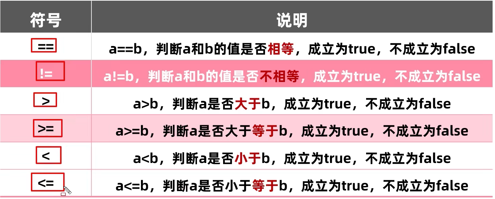

# java基础

## 1、jdk、jre、jvm三者之间的关系

jdk(Java Development Kit)： Java 开发工具包， Java从源码编译，到运行所需要的工具集。

- JVM虚拟机： Java程序运行的地方
- 核心类库： Java已经写好的东西，我们可以直接用
- 开发工具： javac、 java 、jdb、jhat(内存分析工具)

jre：Java 的运行环境，是Java在虚拟机运行时i所用到的工具集 

- JVM、核心类库、运行工具


## 2、什么是关键字

关键字就是被Java赋予了特定含义的英文单词

- 关键字的字母都是小写的
- 常用的代码编辑器，会对关键字进行特殊颜色标记、

class关键字就表示定义一个类，后面跟一个类名

## 3、数据类型


> [!CAUTION]
>
> 声明long型变量时，必须在数据后面以小写的“l”或大写的"L"结尾
>
> 声明float浮点类型的变量，也需要加一个“F”结尾，double不需要
>
> 整数和小数取值范围的大小关系： double > float > long > int > short > byte

①变量类型分类

按数据类型分：——四类八种


**基本数据类型：**数据值存储在自己的空间中

**引用数据类型：**数据值存储在其他空间中，自己空间中存储的是地址值。

方法传递引用数据类型的内存原理：传递的参数为引用数据类型时，传递的时地址值和，形参的改变，影响实际参数的值。

方法传递基本数据类型的内存原理：传递的参数为引用数据类型时，传递的时地址值和，形参的改变，不影响实际参数的值。

## 4、标识符

- [ ] 由26个英文字母大小写、0-9、_或$组成
- [ ] 数字不可以开头
- [ ] 不可以使用关键字和保留字，但能包含保留字和关键字
- [ ] Java中严格的区分大小写，长度无限制
- [ ] 标识符不能包含空格 

**Java名称命名规范：**

- 包名：多个单词组成时所有字母都小写——xxxyyyzzz
- 类名、接口名：多个单词组成时，所有单词首字母大写——XxxYyyZzz
- 变量名、方法名：多个单词组成时，每一个单词首字母小写，第二个单词开始首字母大写——xxxYyyZzz
- 常量名：所有字母都大写，多个单词时每个单词用下划线连接口。XXX_YYY_ZZZ

## 5、键盘录入

```
1、导包 ：import java.util.Scanner;

2、Scanner 实例化  Scanner scan = new Scanner(Sysem.in);、
  int i= scan.nextInt();
```


## 6、运算符

① 算数运算符  \+ - * / % （前)++ (后)++ (前)-- (后)--

> [!CAUTION]
>
> **代码中,如果有小数参与运算,有可能是不精确的**
>
> 不同数据类型的运算首先需要进行转换
>
>  **自动类型提升：**当容量小的数据类型的变量与容量大的数据类型的变量做运算时，结果自动提升为容量大的数据类型
>
> byte、short、char-->int-->long-->float-->double
>
> 

**转换规则：**隐式转换 、强制转换

**隐式转换**：

-  把一个取值范围小的数值转换成取值范围大的数据
- **byte、short、char三种类型的数据在运算的时候，都会直接先提升为int，然后再进行运算**

**强制转换：**把一个取值范围大的数值，赋值给取值范围小的变量，不允许直接赋值，需要进行强制类型转换。数据比较大，在强转的时候可能会发生错误。

<font color="red">**格式：** </font> **目标数据类型  变量名 = （目标数据类型） 被强制转换的数据**

---------------------------------------------------------------------------------------------

**取余（取模）运算%**： 结果的符号与被模数的符号相同，开发中，经常使用%来判断是否能除尽的情况。

**字符串“+”操作：** 当“+”操作出现字符串时，这个“+”是字符串的连接符，进行拼接操作。出现多个“+”操作时，从左到右逐个执行。**字符串无减操作。**

> [!WARNING]
>
> 例： 1+2+“abc”+1 + 2  = 3abc12

**字符+操作：** 当字符+字符或字符+数字时，会把字符通过ASCII码表查询对应的数字再进行计算。

**自++运算：**

（前）++   ：先自增1，然后再运算。

（后）++：先运算，后自增1.

自增1不会改变本身的数据类型。

（前）--：先自减1，后运算。

（后）--：先运算，后自减1.

**赋值运算：**


**关系运算符/比较运算符：**



**逻辑运算符：**


**短路运算符：**


**逻辑运算符与短路运算符之间的区别：**

- 区分& 与 &&：

  相同点：运算结果相同，当符号左边是true时，二者都会执行符号右边的运算

​       不同点：当符号左边时false时，&会继续执行符号右边的运算，&&不再执行符号右边的运算。

- 区分| 与||：

  相同点：二者的运算结果还是相同的，当符号左边都是false时，二者都会执行符号右边的计算

​       不同点：当符号左边时true时，|会继续执行符号右边的运算，而||不会继续执行符号右边的运算。


**三元运算符：**

<font  color="red">**结构：**</font>（条件表达式）？表达式1：表达式2

1. 说明：

​       ①条件表达式的结果都为布尔类型

​       ②根据条件表达式真假，决定执行表达式1，还是表达式2，如果表达式为true，则执行表达式1，若表达式为false，则执行表达式2.

​       ③表达式1和表达式2要求是一致的。

凡是可以使用三元运算符，都可以使用if-else

如果程序既可以使用三元运算符，又可以使用if-else，则优选使用三元运算符，原因是简洁效率高。

**其他运算符：**


## 7、原码、补码、反码

**原码：**十进制的二进制的表现形式，最左边的是符号位，0为正，1为负。

原码弊端：利用原码进行计算时，正数完全没有问题，反如果是负数，结果就会出错，实际的运算方向与正确的运算方向是相反的。

**反码：**为了解决原码不能出现负数的问题而出现的。

反码弊端：负数运算的时候，如果结果不跨0，那么计算结果没有问题，如果结果跨0，那么跟实际的结果会有1的误差。

**反码计算规则：**正数的反码不变，负数的反码在原码的基础上符号位不变，数值取反。

**补码：**为了解决负数计算时跨0的问题而出现的。

**补码计算规则：**正数的补码不变，负数的补码在反码的基础上+1。、

> [!CAUTION]
>
> 计算机中的存储和计算都是以补码的形式进行的。

## 8、进制说明

1、对于整数，有四种不同的表示方式：

- 二进制（binary）：0，1，满2进1，以0b或0B开头。
- 十进制（decimal）：0-9，满10进1.
- 八进制（octal）：0-7，满8进1.
- 十六进制（hex）：0-9及A-F，满16进1，以0x或0X开头表示，此处区分A-F大小写

2、二进制整数 的三种形式：

- 原码：直接将一个数值换成二进制数。最高号为是符号位
- 反码：对原码按位取反，只是最高位（符号位）确定为1.
- 补码：其反码+1.

注：计算机以二进制补码的形式保存所有的整数。

正数的原码、反码、补码都相同，三码合一

负数的补码是反码+1.

 

二进制——>八进制   二进制从右到左每三个一位看成一组。

二进制——>十六进制   二进制从右到左每四个一组看成一位。 

## 9、程序流程控制

- **顺序结构：**

- **选择结构：**

  if-else：

  ```
  if(条件1){
  	结果1；
  }else if(条件2){
  	结果2；
  }else{
  	结果3； 
  }
  ```

  switch -case：

  ```
  switch（表达式）{
      case 常量1：
              语句1；
              //break；
      case 常量2：
              语句2；
              //break;
          ........
       case 常量N：
              语句N；
              //break;
          default:
              语句；
              //break;
  }
  
  //switch新用法 JDK12:
    switch(week ){
               case 1 ->{
      }
  }
  ```

  说明：

  1. 根据switch表达式中的值，依次匹配各个case中的常量，一旦匹配成功，则进入相应的case结构中，调其执行语句。
  2. 当调用完执行语句之后，则仍继续向下执行其他的case结构中的执行语句，直到遇到break关键字或此switc-case结构末尾为止。
  3. break，可以使用在switch-case结构中，表示一旦执行到此关键字，就跳出switch-case结构。
  4. switch结构中的表达式们只能是如下6种类型之一：byte、short、char、int、枚举类型、String类型。表达式不允许放Boolean类型。
  5. case之后只是判断是否相等，只能声明常量，不能声明范围。
  6. break关键字是可选的
  7. default：相当于if-else结构中的else。default结构是可选的。，而且位置是灵活的。
  8. case穿透：就是语句体中没有写break导致。
  9. if-else一般用于对范围的判断，switch-case把有限个数据一一列举出来，任选其一。

- **循环结构：**

循环语句的四个部分：①初始化部分、②循环条件部分-----Boolean类型、③循环体部分、④迭代部分

说明：通常情况下，循环结束都是因为②中的循环条件返回false。

```
for循环  ：for（① ；②；④）{
      ③；
}

while循环：①；
       while（②）{
             ③；
             ④；
}
```

- [ ] 写while循环一定不要丢了迭代条件，一旦丢了，就可能出现死循环。
- [ ] for循环和while循环可以相互转换。
- [ ] for 和while的区别在于①初始化条件的作用范围不一样。

do-while循环：

​                   ①  

​                   do{

​                     ③；

​                     ④；

​                   }while（②）

执行过程：①--->③--->④--->②--->③。。。。。。--->②

说明：

- do-while循环至少会执行一次循环体。执行多次的话while和do-while就没区别。 
- 不在循环条件部分限制次数的结构：for（；；）和while（true）
- 结束循环的几种方式：
  - 方式一  循环条件部分返回false。
  - 方式二  循环体中返回break。 

**无限循环：**循环一直不停止

for(;;) {}    while(true){ }  

**跳过循环：**

continue: 跳过本次循环，继续执行下次循环。

break: 结束整个循环。

## **10、随机数生成**

如何获取一个随机数：double value = Math.random();   //[0.0，1.0)

​                   double value = Math.random()*100;  //[0.0，100.0)

​                    double value = Math.random()*90 +10;   //[0.0，100) ，

   获得一个整型的随机数：int value = (int)(Math.random()*90+10);   //即随机数范围是0-99

**随机数公式：[a,b] ----> (int)(Math.random()\*(b-a+1)+a)**

## 11、数组

**数组：**就是一种容器，可以用来存储同种数据类型的多个值。

> [!CAUTION]
>
> 数组容器在存储数据的时候，需要结合隐式转换考虑，如：int类型的数组容器不能存储Boolean、double类型的数据。容器的类型建议和存储的了

**数组的定义：**

格式一： 数据类型 [ ]  数组名

格式二： 数据类型   数组名[ ]

```
数组长度： arr.length 
```

**数组的初始化：**

- [ ] 静态初始化：在内存中，为数组容器开辟空间，并将数据存储到容器中的过程。

完整格式： 数据类型  [ ] 数组名 = new 数据类型[ ]{元素1，元素2……..} 

简化格式： 数据类型  [ ] 数组名 = {元素1，元素2……..}  

- [ ] 动态初始化：初始化时只指定数组长度，有系统为数组分配初始值。

格式： 数据类型[ ] 数组名  = new 数据类型[ 数组长度]；

​	    String[] names = **new** String[5];

说明：

​	数组元素的默认初始化值-----不同类型的数据类型默认初始化值

​	①数组元素是整型元素：0

​	②数组元素是浮点型：0.0

​	③数组元素是char类型：0

​	④数组元素是Boolean型：false

​	⑤数组元素是String类型：null

**动态初始化与静态初始化之间的区别：**

动态初始化：手动指定数组长度，由系统给出默认的初始化值

只明确元素个数，不明确具体数值，用动态初始化。

静态初始化：手动指定数组元素，系统会根据元素个数，计算出数组长度。

需求中明确了要操作的具体数据，直接用静态初始化即可。

**数组中常见的问题：**数组索引越界。


**数组内存分配：**

栈： 方法运行时使用的内存，比如main方法运行，进入方法栈中执行

堆： 存储对象或者数组，new来创建的，都存储在堆区

方法区： JVM使用操作系统的时候使用，和我们开发无关

寄存器： 给CPU使用，和我们开发无关。


## 12、方法

**方法定义：**方法是程序中最小的执行单元。

什么地方会用到方法： 重复的代码，具有独立功能的代码可以抽取到方法中。

方法的好处：提高代码的复用性和可维护性。

什么时候用到有返回值的结果？ 在调用处要根据方法的结果，去编写另外一段代码。

**有返回值的方法的定义格式？**

```
public static 返回值类型 方法名（参数）{
	方法体；
	return 返回值；
}
```

有返回值方法的调用格式：直接调用、赋值调用、输出调用

**方法的重载：**

- 在同一类中，定义了多个同名的方法，这些方法名具有相同的功能。
- 每个方法具有不同的参数类型或参数个数，这些同名的方法，就构成了重载关系。

**<font color="red">简单记：在同一个类中，方法名相同，参数不同的方法（包括参数类型或参数个数或顺序不同）。与返回值无关。</font>**

虚拟机根据参数的不同来确定调用的方法

基本数据类型：数据值存储在自己的空间中

引用数据类型：数据值存储在其他控件中，自己空间中存储的是地址值。

**方法传递引用数据类型的内存原理**：传递的参数为引用数据类型时，传递的时地址值和，形参的改变，影响实际参数的值。

**方法传递基本数据类型的内存原理**：传递的参数为引用数据类型时，传递的时地址值和，形参的改变，不影响实际参数的值。


## 13、面向对象

**1、理解面向对象（OOP）和面向过程（POP）:**

二者都是一种思想

**面向过程强调功能行为，以函数为最小单位，考虑怎么做**

<font color="red">**面向对象，将功能封装在对象，强调了具备功能的对象，以类和对象为最小单位，考虑谁来做**</font>

面向对象更加强调运用在人类再日常生活中的思维逻辑中采用的思想方法和原则，如：抽象、分类、继承、聚合、多态等。

**2、面向对象的三大特征：封装、继承、多态**

**3、类和对象**

类：对一类事物的描述，是抽象的、概念上的定义

对象：是实际存在的该类事物的每个个体，也被称为实例

理解：类=抽象概念的人；对象=实实在在的某个人（类是对象的抽象，对象是类的具体）

面向对象程序设计的重点是类的设计，**类的设计，其实就是类的成员的设计**，

> [!NOTE]
>
> **定义类的补充注意事项**
>
> - 用来描述一类事物的类，专业叫做Javabean类，Javabean类中不写类方法。
> - 类名首字母建议大写、英文、有意义，满足驼峰命名，不能用关键字
> - 一个代码文件中可以定义多个类，但是只能一个类是public修饰的，public修饰的类必须是Java代码的文件名称
>
> 
>
> 

属性 == 成员变量 == field ==域、字段

方法== 成员方法 == 函数 == method

**成员变量的完整定义格式：** 修饰符 数据类型 变量名称 = 初始化值

**4、类和对象的使用（面向对象思想落地的实现）**

 \* 一、创建类，设计类的成员

 \* 二、创建类的对象 = 类的实例化 = 实例化类 -----> 类名 对象名 = new 类名（）；

 \* 三、通过“对象.属性”/“对象.方法”调用对象的结构

## 14、面向对象特征——封装

对象代表什么，就得封装什么样的数据，并提供数据对应的行为

**一、封装的体现：**

<font color="red">①我们将类的属性×××私有化（private），同时，提供公共的（public）方法来获取（getXxx）和设置（setXxx）此属性的值。</font>

<font color="red">②不对外暴露的私有的方法</font>


对象代表什么,就得封装对应的数据,并提供数据对应的行为.

**说明 ：封装性的体现，必须要有权限修饰符来配合**

  Java规定的4种权限：（从大到小排列）：private--->缺省（default）--->protected--->public

| 修饰符    | 类内部 | 同一个包 | 不同包的子类 | 同一个工程 |
| --------- | ------ | -------- | ------------ | ---------- |
| private   | yes    |          |              |            |
| (缺省)    | yes    | yes      |              |            |
| protected | yes    | yes      | yes          |            |
| public    | yes    | yes      | yes          | yes        |

4种权限可以用来修饰类及类的内部结构：属性、方法、构造器、内部类

4种权限都可以来修饰类的内部结构（属性、方法、构造器、内部类），修饰类的话，只能使用（缺省）和public 

封装性总结：Java提供了四种修饰符来修饰类及类的内部结构，体现类 及类的内部结构在被调用时可见性的大小。

## **15、面向对象——this关键字**

 this的使用

1、作用：可以用来修饰和调用：属性、方法、构造器

2、this修饰属性和方法：this理解为：当前对象

  在类的方法中，我们可以使用"this.属性"或”this.方法“的方式，调用当前对象属性或方法，但是，通常情况下，我们可以选择省略“this.”，特殊形况下，如果方法的形参和类的属性同名时，我们必须显式的使用**“this.变量”**的方式,表明此变量的属性。

**this关键字就是用来区分局部变量和成员变量**

**this的本质:代表方所在法调用者的地址值**

## 16、面向对象——构造器

构造方法在创建对象的时候,由**虚拟机**自动调用**,给成员变量进行初始化.** 每创建一次 对象，就调用一次构造方法

1、作用：①创建对象(new +构造器)  Person p1 = new Person()

​        ②初始化对象的信息

2、说明：

①如果没有显示的定义类的构造器的话，则系统默认提供一个空参的构造器；

②定义一个构造器的格式：权限修饰符  类名（形参列表）{ }

**构造器名与类名相同，分为有參构造和无參构造**

无參构造方法：初始化对象时，成员变量的数据均采用默认值

有参构造方法： 在初始化对象的时候，同时为对象进行赋值。

eg: public Person(){

​     

​    }

③一个类种定义多个构造器，彼此之间构成重载，带參的构造方法和无參构造方法两个方法名相同，但是参数不同，这叫做构造方法的重载。

④一旦显式的定义了构造器，系统就不再提供默认的空参的构造器。

⑤一个类中至少有一个构造器。

## 17、面向对象——标准JavaBean类

- 类名需要见名知意
- 成员变量使用private修饰
- 提供至少两个构造方法    无參构造方法    带全部参数的构造方法
- 成员方法   提供每一个成员变量的setXxx() / getXxx(),  

## 18、面向对象——一个对象的内存图

Student  s = new Student();

> [!IMPORTANT]
>
> 1. 加载class文件
>
> 2. 声明局部变量
>
> 3. 在堆内开辟一个空间
>
> 4. 默认初始化
>
> 5. 显示初始化
>
> 6. 构造方法初始化
>
> 7. 将堆内存中的地址值赋值给左边的局部变量
>
>    

